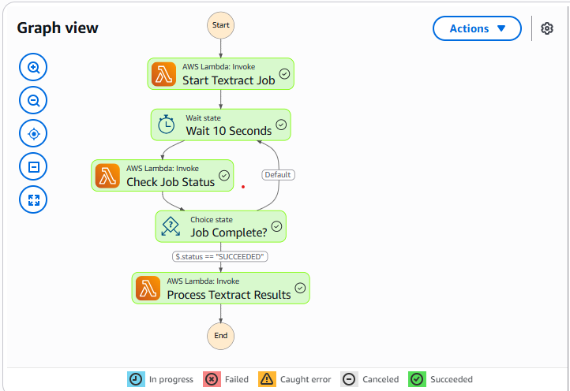
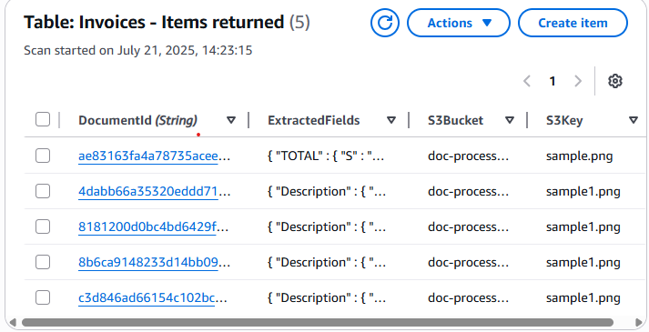
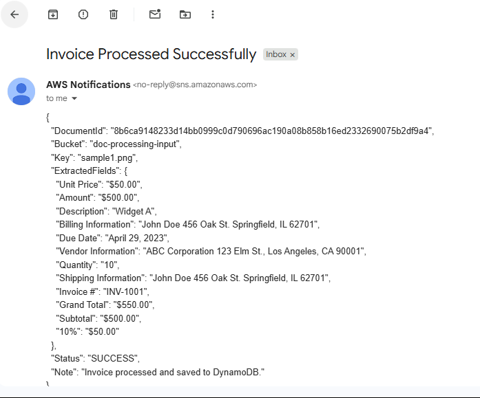
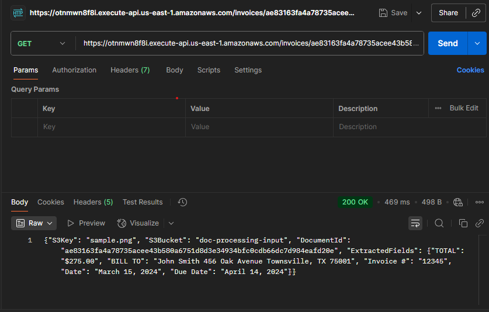

# 🧠 Intelligent Document Processor (IDP) using AWS AI Services

An end-to-end serverless pipeline that automatically processes uploaded invoices and extracts structured data (like vendor name, total, due date, etc.) using AWS Textract — then stores it in DynamoDB, sends a notification, and makes the result queryable via API.

---

## 🚀 What It Does

1. Upload a scanned invoice (PDF or image) to an S3 bucket
2. Triggers a Step Function to start a Textract OCR job
3. Extracts key-value pairs (Invoice #, Date, Total, etc.)
4. Saves results in DynamoDB
5. Sends an email with the extracted summary
6. Allows API access to query invoices by Document ID

---

## 🧰 Tech Stack (100% Serverless)

| AWS Service       | Role                                                                 |
|------------------|----------------------------------------------------------------------|
| S3               | File upload trigger and storage                                      |
| Lambda           | Executes logic at each step                                          |
| Step Functions   | Orchestrates the entire flow                                         |
| Textract         | Performs OCR + key-value pair extraction                             |
| DynamoDB         | Stores structured invoice data                                       |
| SNS              | Sends email notification after success                               |
| API Gateway      | Exposes REST endpoint to retrieve invoice data                      |
| CloudWatch       | Logs and monitors the entire pipeline                                |

---

## 📁 Folder Structure

intelligent-doc-processor/
├── lambdas/ # All Lambda function source code
├── step-function-definition/ # JSON file for Step Function
├── sample-documents/ # Sample invoice images + Textract result
├── screenshots/ # Execution proof: SNS, Step Function, DynamoDB, API
├── README.md
└── .gitignore


---

## 🔍 Example Output

Here’s what a successful extraction looks like (via API):

```json
{
  "DocumentId": "ae83163fa4a...",
  "S3Bucket": "doc-processing-input",
  "S3Key": "sample.png",
  "ExtractedFields": {
    "Invoice #": "12345",
    "Date": "March 15, 2024",
    "Due Date": "April 14, 2024",
    "TOTAL": "$275.00",
    "BILL TO": "John Smith 456 Oak Avenue Townsville, TX 75001"
  }
}
```

##📸 Screenshots

| Description             | Image                               |
| ----------------------- | ----------------------------------- |
| ✅ Step Function Success |    |
| 🗃 DynamoDB Record      |  |
| 📧 SNS Email Received   |  |
| 🌐 API GET Invoice      |    |

## 🧪 Sample Files
Sample invoice documents and Textract output can be found in /sample-documents.

## 🧠 Skills Demonstrated
Serverless architecture design (S3 → Lambda → Step Functions)

Document AI and OCR with AWS Textract

Event-driven compute with S3 triggers and Step Functions

NoSQL data modeling with DynamoDB

REST API integration with Lambda + API Gateway

Automated notifications using SNS

Monitoring and debugging with CloudWatch

## 🧭 Run Your Own Version (Coming Soon)
Detailed deployment instructions will be added in a future update. For now, feel free to explore the Lambda code and Step Function logic.

## 📬 Contact

Built by Kanva Trivedi

Open to opportunities in software engineering, data engineering, and cloud architecture roles.
